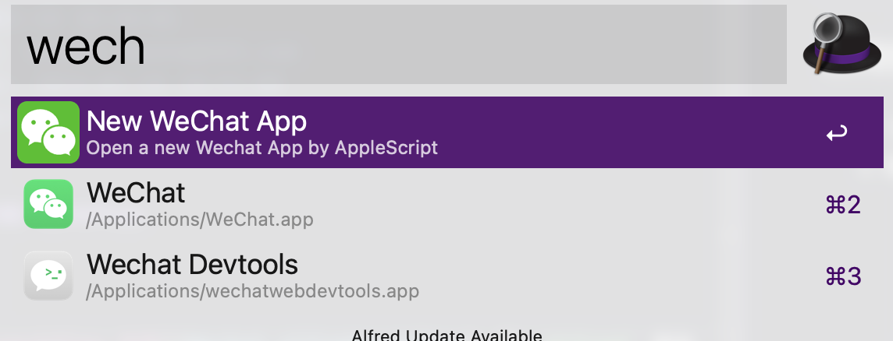

<!--
 * @Date: 2024-02-19 18:44:01
 * @LastEditors: laoona laoona@163.com
 * @LastEditTime: 2024-02-19 18:57:04
 * @FilePath: /alfred-workflow-wechat-ghost/READEME.md
-->

# Alfred 微信双开 workflow

> 注意：目前只支持最多打开两个微信窗口

## 为什么会写一个这样的 workflow

- 两个微信需求
- 网上找了几个微信双开的方法，都没达到自己理想的效果，比如通过 `Alfred` 二次打开，显示活动窗口

## 如何使用

1. 下载 [Wechat workflow 文件](Wechat.alfredworkflow)，在 `Alfred` 里执行导入
2. 输入 `wechat` 关键字，打开 `New WeChat App`
   
